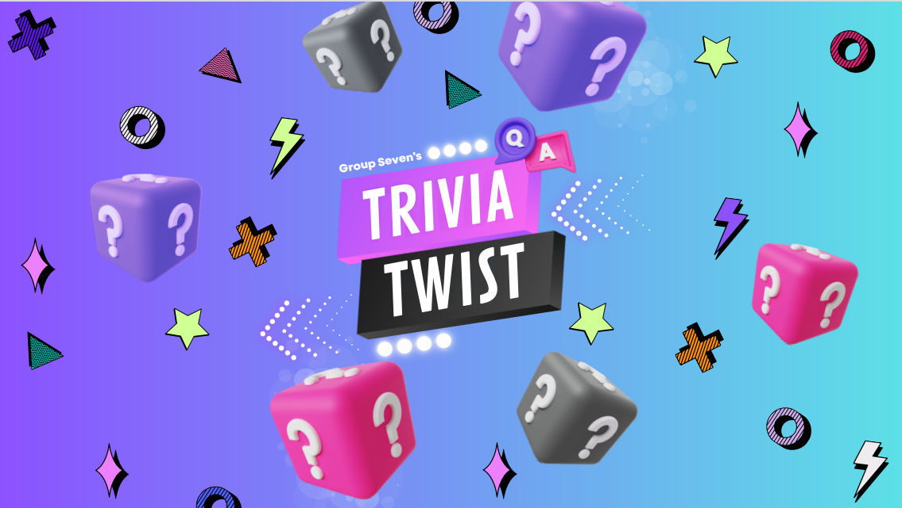
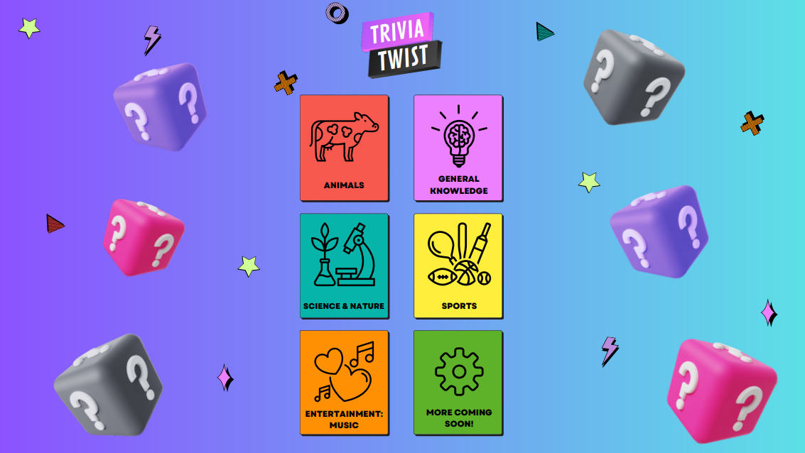
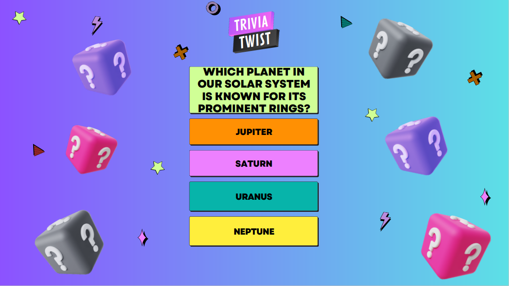
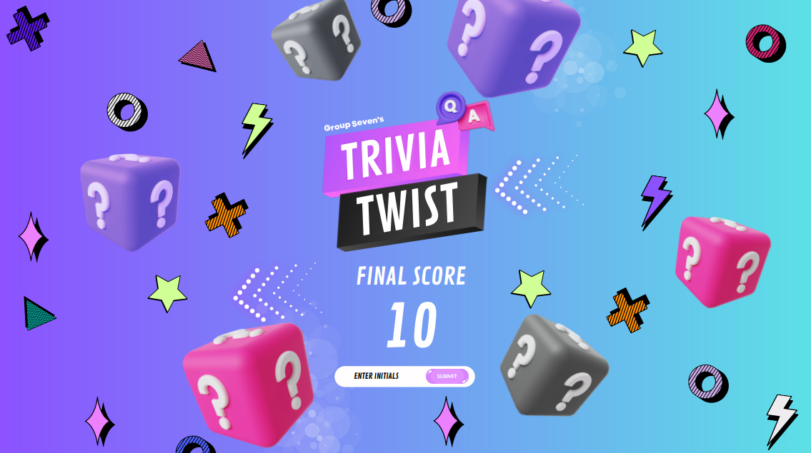
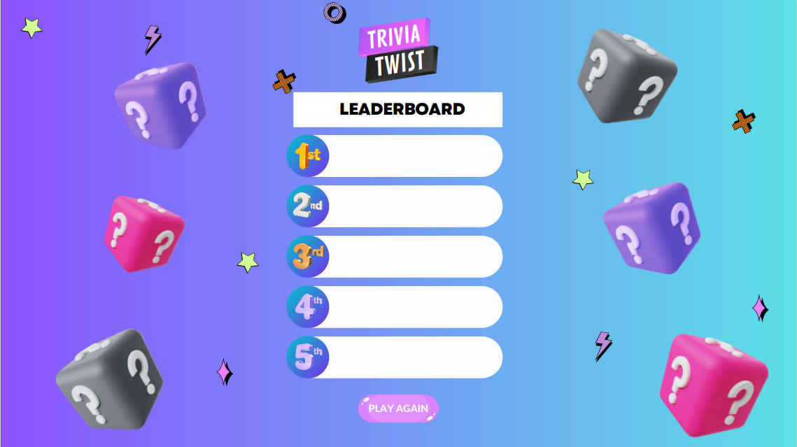
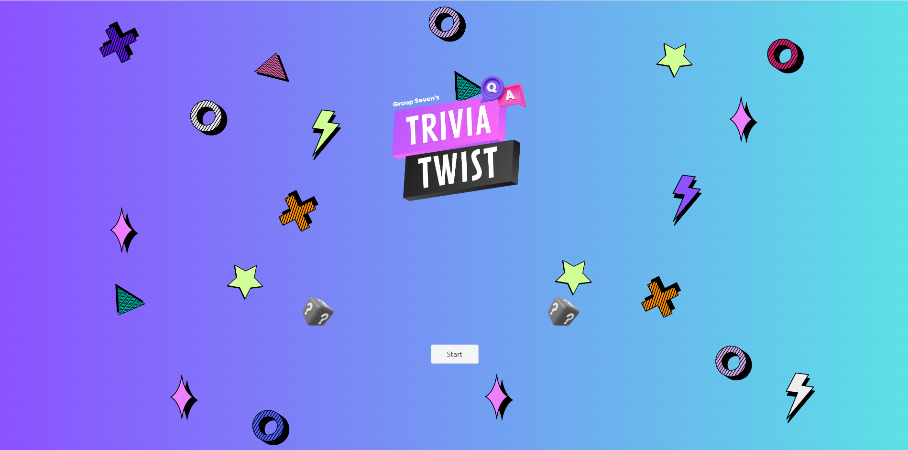
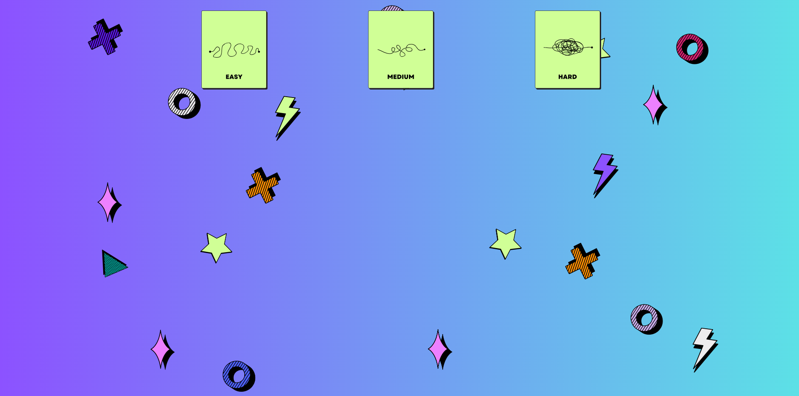
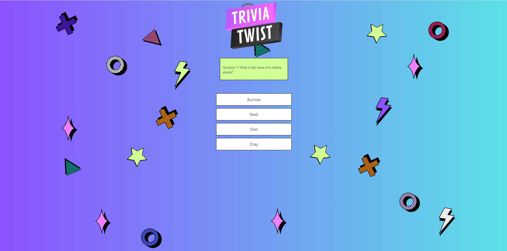
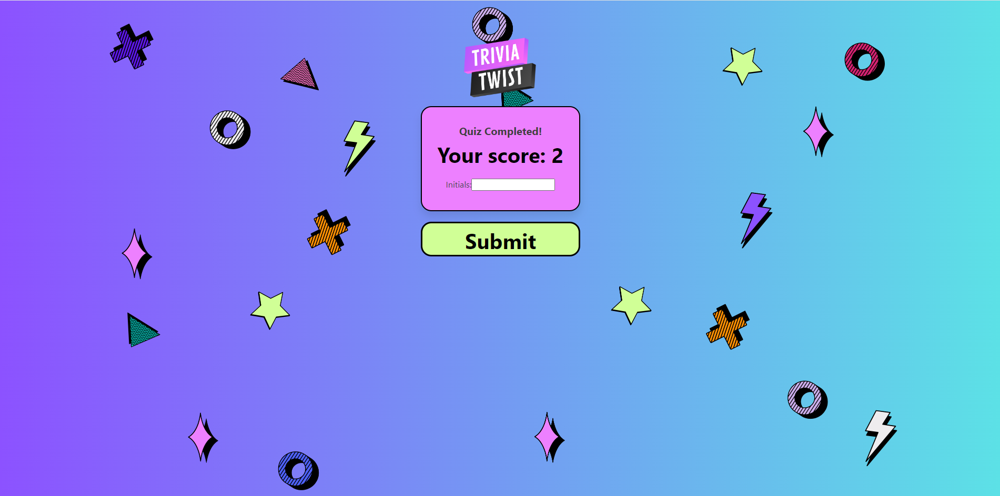

# trivia-twist - 'Mind-Twisting Trivia!'

We built a single page React application for a Trivia Quiz as our group final project for the edX Front-End Web Development course. The quiz offers users a fun and interactive experience, with thoughtfully selected questions from different categories and difficulty levels. The app also features animations and sound effects to make it more exciting. After finishing the quiz, users can enter their name to see how they rank on the leaderboard, making it competitive and engaging.

## Our User Story

"As a Trivia Enthusiast, I want to participate in an engaging quiz experience where I can select categories and difficulty levels to challenge myself. I expect the quiz to have animations and sound effects to make it more enjoyable. After completing the quiz, I want to be able to enter my name to join the leaderboard and compete with other players".

## Our Acceptance Criteria

The application must have the following :

#### Category and Difficulty Selection:

Users should be able to select trivia categories from a predefined list.
Users should be able to choose the difficulty level of the questions (e.g., easy, medium, hard).

#### Quiz Experience

The quiz should consist of 10 questions in total.
Each question should be displayed one at a time.
There should be animations and sound effects to enhance the user experience.
Users should be able to move to the next question after answering the current one.
Leaderboard:

#### Leaderboard

Upon completing the quiz, users should have the option to enter their name.
Names entered by users should be displayed on the leaderboard along with their scores.
The leaderboard should be accessible for all users to view.

#### Error Handling

Proper error messages should be displayed if there are any issues with fetching questions or submitting user details.

#### Responsive Design

The application should be responsive and work seamlessly across different devices and screen sizes.

#### Accessibility

The application should adhere to accessibility standards, ensuring it is usable by individuals with disabilities.

#### Performance

The application should be optimized for performance, with minimal loading times and smooth transitions between pages.

## About the Trivia-Twist Team

Meet the dedicated individuals behind Trivia-Twist application:

>Arvinder Anand (Tim)

Proficient in React and JavaScript and brings valuable project management skills to our development team. 

>Esther Babirye

Esther is proficient in React, CSS development, and graphic design, contributing her talents to create visually appealing interfaces.

>Leonie Whitehead

Leonie excels in React development and graphic design, enriching our project with her creative flair and technical proficiency.

>Nicole Sharpe

Nicole specializes in React development, CSS, and graphic design, playing a vital role in crafting captivating user experiences.

>Obaid Gulzar

Obaid is a skilled React and JavaScript developer, contributing his expertise to ensure the functionality and performance of our application.

## FAQs

>*What was our team's motivation?*

Our team was motivated by the learning experience working in a team and with the shared goal of enhancing our web development skills and advancing our careers.

>*Why we built this project?*

Building the applciation allowed us to bridge the gap between theoretical knowledge and practical application of React, Javascript and CSS.

>*What problem did this project solve?*

The React application for the Trivia Quiz solves the problem of creating an enjoyable and engaging experience for Trivia enthusiasts. 

>*What did we learn?*

We learned about how to plan for the successful development of an interactive single-page application in React. Our objectives were initially laid out, conducted research on the Trivia API, established coding standards, and developed skills for creating prototypes using wireframes. GitHub Project Kanban allowed issues to be raised (Story Points: Low, Medium, and High) and assigned to various members of the team. Based on the issues we raised, we followed Agile Development principles by focusing on the Minimum Viable Product (MVP) and delivering the most basic working application, then enhancing it. Daily Standup practice became a habit for us, where each of us discussed what we had achieved in the last day, work to be done next, and issues that were experienced in case someone else from the team could assist

#### Back End Team
Responsible for creating the back end logic, making use of available API ensuring they worked correctly and were integrated successfully, managing data storage and the performance of the system. It is pretty much everything behind the scenes to make the front end functional.

#### Front End Team
Focussed on designing prototypes of our logo and web page designs, building the user interface (UI) and user experience (UX) of the application. The Front End Team role also worked on the
React component code.

Overall, we further built up upon our skills that we have learnt in the entire edX Front-End Web Development course. Yes, it was hardwork, but we also learnt to have some fun too! All the above will help us to work successfully in a commercial environment.

> What makes our project stand out? 

Our project truly stands out because we've put in a lot of effort to make it great. It shines brightly because we've been dedicated to making sure everything about it is excellent. From the planning stages to the design and programming, we've followed top-notch practices every step of the way.

We have applied the principles of Separation of Concern to the entire project and this includes assigning every person a separate task and this includes separating the React application into
various components with separate javascript and css files. In the React and Javascript coding, we ensured that each function did one thing and did it well. The code is readable and maintainable. 

As a group, we pushed ourselves continually ensuring our work was of the highest quality.  

> Technologies Used

* React
* Javascript
* Local Storage used for storage of user names and scores
* Web API calls from OpenTrivia Database
* CSS
* NPM Packages: Bulma, Anime and Use-Sound

> Tools Used

* Code Editor: Visual Studio Code 
* Graphics: Canva, Google Fonts
* Graphics Conversion: react-svgr.com, nikitahl.github.io/svg-2-code, editsvgcode.com and svg2jsx.com
* Source Control: Git and GitHub
* Communications: Zoom Online Meetings and Slack

## Installation

The GitHub repository for our group project can be found at: 

https://github.com/timsbootcamp/trivia-twist

The source code can be cloned from the above link. 

## Usage

Link to deployed site of our group project on Trivia-Twist
https://triviatwist.netlify.app

## Screenshots of Trivia Twist Application

>*Trivia-Twist Logo*

## Screenshots of Design Wireframes

>*Wireframe for Home Page*   

>*Wireframe for Category Selection Page*   

>*Wireframe for Question and Answer Page*   

>*Wireframe for Quiz Result Page*   

>*Wireframe for Leaderboard Page*   

## Screenshots of Trivia-Twist Application

>*Home Page*    

>*Category Selection Page*    

>*Difficulty Selection Page*    

>*Question and Answer Page*    

>*Quiz Result Page*    

>*Leaderboard Page*    

## Documentation of Folders of our Project

'src' holds all mandatory React application files.

'src\Components' holds all React components.

'src\Lib' holds all Javascript function files.

'src\Sounds' holds all sounds.

'src/documentation' holds all documentation images files for readme.

'public\assets' holds all application image files.

## Credits

[Canva](https://www.canva.com/en_gb/)

[freesound.org](https://freesound.org/)

